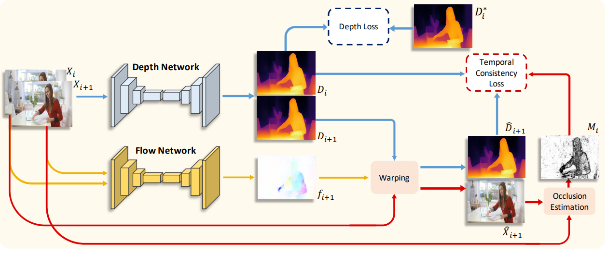
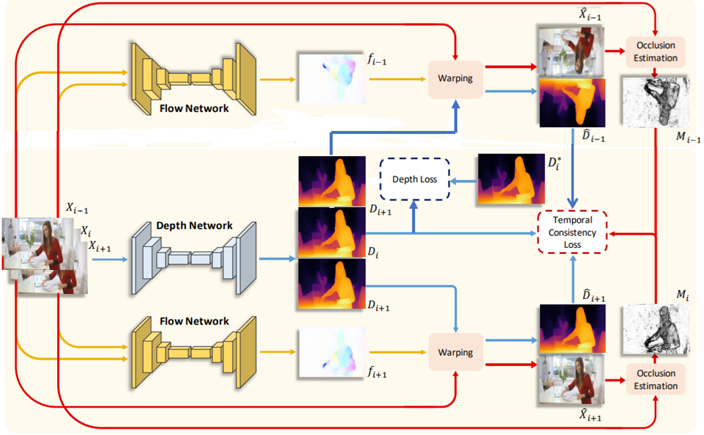

<h2 align="center">TCMonoDepth: Enforcing Temporal Consistency in Video Depth Estimation</h2>

#### This repository has implemented the training of the TCMonodepth and made improvements to it, enhancing the temporal consistency of TCMonodepth and the effect of monocular depth estimation for videos. ####

  
  
The algorithm architecture of the original paper

The implementation and improvement of the algorithm are as follows:
1. The RAFT network is adopted to conduct optical flow estimation, and the unidirectional optical flow verification in the original paper is changed to bidirectional optical flow verification. 
The caculation of valid mask in original paper：

  

The improved method:

  

2. The improvement of the temporal consistency loss.
The original tc loss is as follows:

  

The improved tc loss:

  

3. I have provided a three-frame version. When optical flow estimation is performed on two frames, there will be the problem of optical flow occlusion. Utilizing the previous frame, the middle frame and the subsequent frame can effectively solve the problem of optical flow occlusion and make use of more effective optical flow information. 
The improved tc loss:

  

4. This is just a depth estimation algorithm at the image level although using tc loss to improve the temporal consistency of video depth. I would like to use a video depth estimation network to estimate video depth. Using two-stage training method, the first stage involves training on single images, the second stage involves training on videos to maintain temporal consistency by adding the temporal consistency loss and multi-frames(such as more than 5 frames).

### Train ###
python train.py

### Test ###
python val.py

## inference
- [1] Enforcing Temporal Consistency in Video Depth Estimation